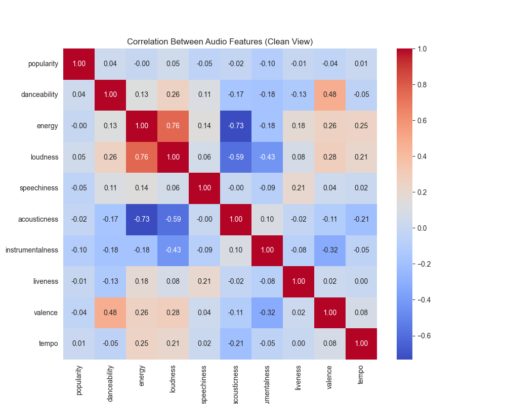
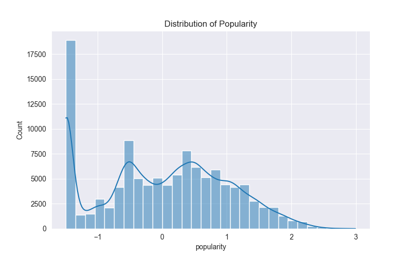
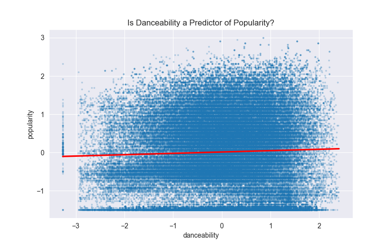
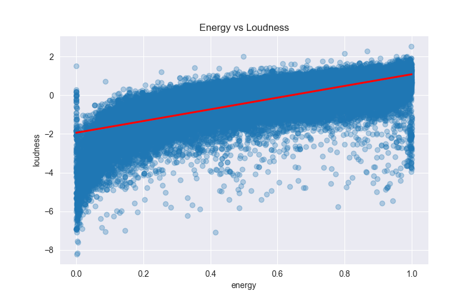
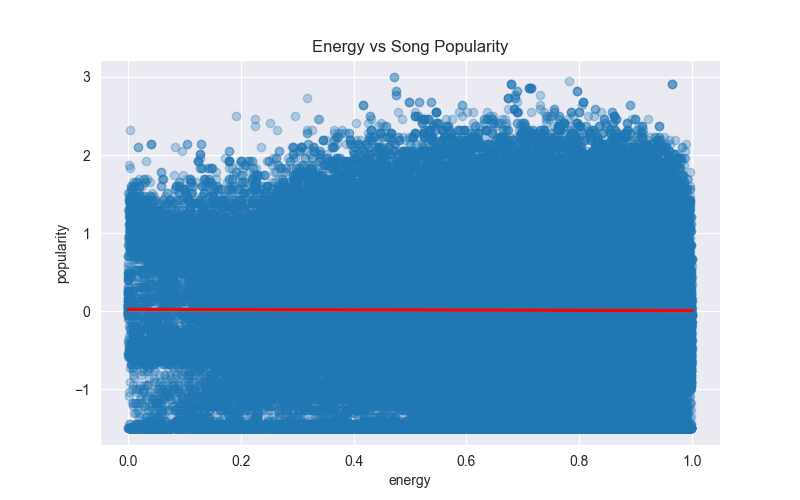
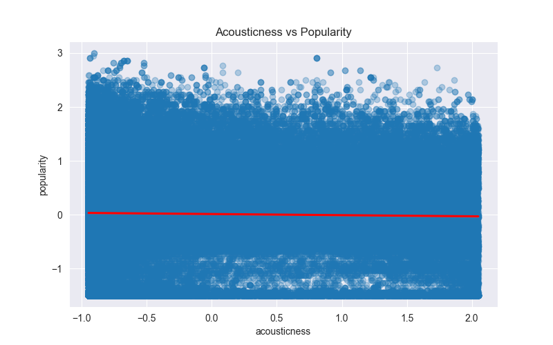
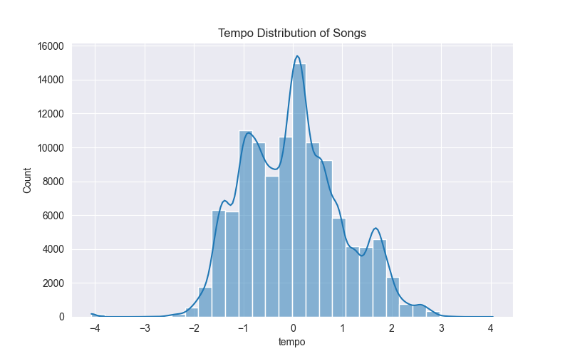
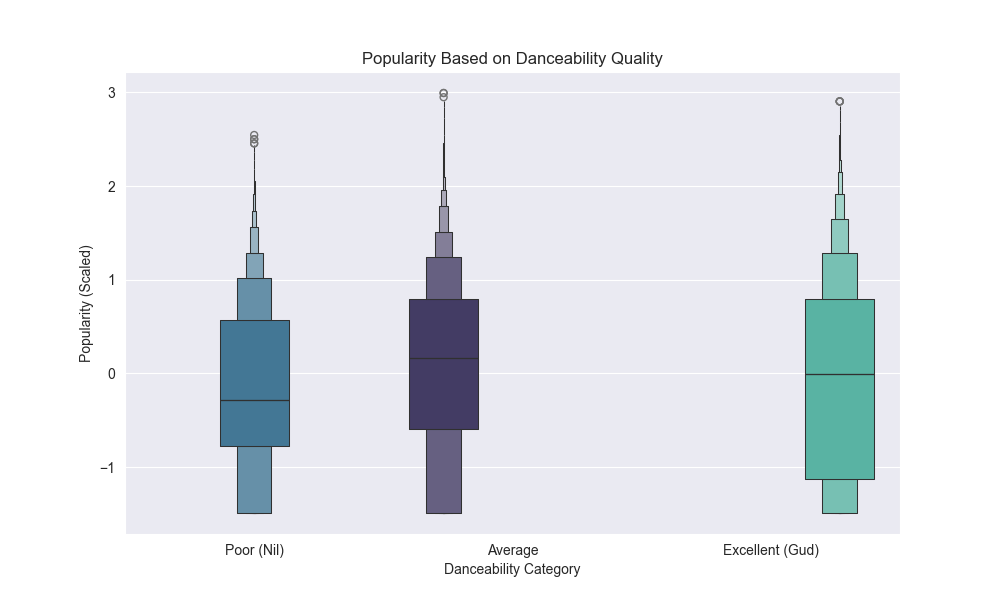
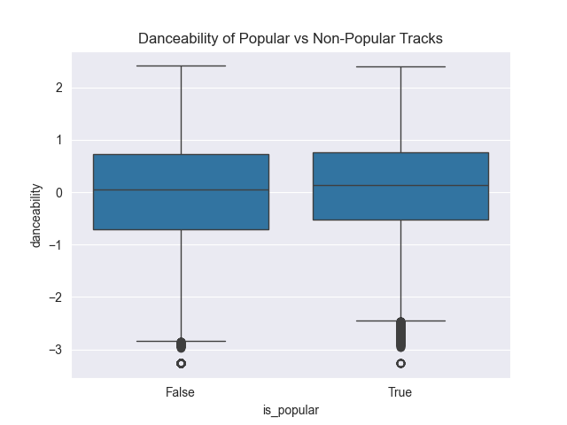

# 🎧 Spotify Audio Feature Analysis

### A Statistical Investigation into Song Popularity


[](https://spotify-audio-analysis.streamlit.app)

<p align="center">

</p>

---

# 📌 Project Overview

Music streaming platforms such as Spotify analyze millions of songs using machine learning and signal-processing techniques. These systems extract **audio features** that numerically describe musical characteristics such as rhythm, intensity, emotional tone, and acoustic composition.

This project performs a comprehensive **Exploratory Data Analysis (EDA)** on a dataset containing **over 114,000 Spotify tracks**. The objective is to investigate whether a song’s **musical attributes can explain its popularity score**.

Spotify assigns each track a **popularity value from 0–100**, calculated using streaming behavior such as:

• Total number of streams
• Recency of listening activity
• User engagement

This raises an important question in music analytics:

**Can musical success be predicted using audio features alone?**

Or

**Are external factors such as marketing, playlist placement, and artist reputation more influential?**

By analyzing statistical relationships between audio features and popularity, this project aims to uncover patterns in music data and challenge common assumptions about hit songs.

---
# ⭐ Key Highlights

• Analysis of **114,000+ Spotify tracks**

• Identification of **long-tail popularity distribution**

• Discovery of strong **Energy–Loudness correlation**

• Demonstration that **danceability does not predict popularity**

• Development of an **interactive Streamlit dashboard**

• Visualization of multiple **feature relationships**

---

# 📑 Table of Contents

* Project Overview
* Project Objectives
* Dataset Description
* Technology Stack
* Project Structure
* Installation Guide
* Data Science Workflow
* Methodology
* Exploratory Data Analysis
* Visualization Gallery
* Executive Insights
* Myth Investigation
* Results Summary
* Limitations
* Future Improvements
* Interactive Dashboard
* Skills Demonstrated
* Author

---

# 🎯 Project Objectives

The analysis was designed to accomplish several goals:

### Dataset Understanding

* Explore the structure and dimensions of the Spotify dataset
* Identify important audio features describing songs

### Data Cleaning

* Detect and remove missing values
* Remove duplicate records

### Exploratory Data Analysis

* Study feature distributions
* Visualize relationships between attributes

### Correlation Analysis

* Identify strong statistical relationships between features

### Myth Testing

Evaluate common beliefs about successful music.

### Insight Generation

Extract meaningful conclusions about what drives song popularity.

---

# 📊 Dataset Description

The dataset contains 114,000+ Spotify tracks with audio features extracted using Spotify’s audio analysis algorithms.
Each row represents a song with multiple attributes describing musical characteristics, metadata, and engineered features.

| Feature              | Description                                      |
| -------------------- | ------------------------------------------------ |
| **danceability**     | Measures how suitable a track is for dancing     |
| **energy**           | Represents intensity and activity level          |
| **loudness**         | Overall track loudness measured in decibels      |
| **speechiness**      | Detects presence of spoken words                 |
| **acousticness**     | Probability that the track is acoustic           |
| **instrumentalness** | Predicts whether a track contains vocals         |
| **liveness**         | Detects the presence of an audience in recording |
| **valence**          | Musical positivity (happy vs sad sound)          |
| **tempo**            | Estimated tempo of the track in BPM              |

## 📊 Dataset Snapshot

| Metric | Value |
|------|------|
Total Songs | 114,000+ |
Audio Features | 9 |
Genres | Multiple |
Popularity Range | 0–100 |
Data Type | Numerical + Categorical |

## Dataset

The dataset used in this project is too large to store in the repository.

You can download it from:

https://www.kaggle.com/datasets

Place the file in:

data/spotify.csv

---

# 🛠 Technology Stack

| Tool             | Purpose               |
| ---------------- | --------------------- |
| Python           | Programming language  |
| Pandas           | Data manipulation     |
| NumPy            | Numerical computation |
| Matplotlib       | Visualization         |
| Seaborn          | Statistical plots     |
| Jupyter Notebook | Data exploration      |
| Streamlit        | Interactive dashboard |

---

# 📂 Project Structure

```
spotify-audio-analysis
│
├── data
│   └── spotify.csv
│
├── notebooks
│   └── spotify_analysis.ipynb
│
├── visuals
│   ├── popularity_distribution.png
│   ├── correlation_heatmap.png
│   ├── danceability_popularity.png
│   ├── energy_loudness.png
│   ├── acousticness_vs_popularity.png
│   ├── tempo_distribution.png
│   ├── energy_vs_popularity.png
│   ├── popular_vs_nonpopular.png
│   └── acousticness_vs_energy.png
│
├── dashboard
│   └── app.py
│
├── requirements.txt
│
└── README.md
```

---

# ⚙️ Installation Guide

### Clone the Repository

```bash
git clone https://github.com/yourusername/spotify-audio-analysis.git
```

### Navigate to Project Folder

```bash
cd spotify-audio-analysis
```

### Install Dependencies

```bash
pip install -r requirements.txt
```

### Launch Notebook

```bash
jupyter notebook
```

---

# 🧭 Data Science Workflow

```
Raw Spotify Dataset
        │
        ▼
Data Cleaning & Preprocessing
(Remove null values, duplicates)
        │
        ▼
Exploratory Data Analysis
(Distributions, scatter plots)
        │
        ▼
Statistical Analysis
(Correlation patterns)
        │
        ▼
Myth Investigation
(Test industry assumptions)
        │
        ▼
Insights & Conclusions
```

---

# 🔬 Methodology

### Data Loading

```python
import pandas as pd
df = pd.read_csv("data/spotify.csv")
```

### Data Inspection

```python
df.info()
df.describe()
```

### Data Cleaning

```python
df.dropna(inplace=True)
df.drop_duplicates(inplace=True)
```

### Exploratory Analysis

EDA techniques used:

• Histograms
• Scatter plots
• Regression plots
• Box plots
• Correlation heatmaps

---

# 📈 Exploratory Data Analysis

## Popularity Distribution

<p align="center">

</p>

The distribution of Spotify popularity scores shows a long-tail pattern. Most tracks receive low popularity values, while only a small percentage achieve high engagement levels.

> **Insight:** 
> This suggests that the streaming ecosystem behaves like a winner-takes-most market, where a small number of songs capture the majority of listener attention.

---

## Feature Correlation Heatmap

<p align="center">

</p>

The correlation matrix highlights relationships between different audio attributes.

Key observations:

• Energy and Loudness show strong positive correlation

• Energy and Acousticness show strong negative correlation

> **Insight:** 
> Some audio features capture similar musical properties, meaning they may provide overlapping information in analysis.

---

## Danceability vs Popularity

<p align="center">

</p>

This scatter plot explores the relationship between danceability and popularity.

> **Insight:** 
> The nearly horizontal trend line indicates very weak correlation, suggesting that highly danceable songs are not necessarily more popular.

---

### 📊 Additional Feature Visualizations

Below are key visualizations generated during the exploratory data analysis.

The following visualizations further explore relationships between different Spotify audio features and popularity.

<table>
<tr>
<td></td>
<td></td>
</tr>

<tr>
<td></td>
<td></td>
</tr>

<tr>
<td></td>
<td></td>
</tr>

<tr>
<td colspan="2" align="center">
</td>
</tr>
</table>

These visualizations highlight additional patterns in how different musical attributes relate to popularity.

> **Key Insights**
>
> 1. **Energy and Loudness** show strong positive correlation, reflecting common music production practices.
> 2. **Energy vs Popularity** suggests that energetic songs are common but energy alone does not guarantee higher popularity.
> 3. **Acousticness vs Popularity** shows that both acoustic and electronic songs can achieve high popularity.
> 4. **Tempo Distribution** reveals that most songs fall within the 100–130 BPM range typical of mainstream genres.
> 5. **Popular vs Non-Popular Songs** confirms the long-tail distribution where only a small fraction of tracks become highly popular.
> 6. **Danceability Category Analysis** further reinforces that danceability alone does not determine success.

---

# 🔎 Executive Insights

The exploratory analysis reveals several key patterns in how **musical characteristics relate to song popularity on Spotify**.  
Although the dataset includes detailed machine-learning derived audio attributes, these features alone do not fully explain why some songs achieve widespread success.

---

## 📊 Popularity Distribution

The **Spotify popularity score** displays a clear **long-tail distribution**.

- A large portion of songs receive **very low popularity scores**
- Only a small fraction of tracks reach **high engagement levels (70–100)**

> 💡 **Key Insight**  
> The streaming ecosystem behaves like a **winner-takes-most market**, where a limited number of tracks capture the majority of listener engagement and streams.

This pattern is common across digital platforms where discovery is influenced by:

- Recommendation algorithms  
- Playlist placements  
- Listener engagement loops  

---

## 🔗 Feature Correlation

Correlation analysis shows that **Energy** and **Loudness** have the **strongest positive relationship** among all audio attributes.

High-energy songs are typically produced with **greater amplitude and dynamic intensity**, which naturally results in louder recordings.

> 🔎 **Observation**  
> The strong relationship between these features indicates they capture **similar aspects of musical intensity and production style**.

This relationship reflects common production practices where energetic tracks are intentionally mixed to sound **more powerful and impactful**.

---

## 💃 Danceability vs Popularity

Danceability is often assumed to be a major factor behind successful songs, particularly in **pop and electronic music**.

However, the analysis reveals **no strong statistical relationship between danceability and popularity**.

Tracks with both:

- **High danceability**
- **Low danceability**

appear across the **entire popularity spectrum**.

> 📊 **Interpretation**  
> While danceability improves rhythmic appeal, it is **not a reliable predictor of commercial success on its own**.

---

## ⏱ Tempo Patterns

Most songs in the dataset fall within a **moderate tempo range of approximately 100–130 BPM**.

This tempo range is common across several mainstream genres:

- 🎵 **Pop**
- 🎧 **Electronic Dance Music (EDM)**
- 🎤 **Hip-Hop**

Despite this clustering, the analysis does **not show a meaningful relationship between tempo and popularity**.

> 🎶 **Conclusion**  
> Songs both inside and outside this BPM range can achieve high popularity, suggesting that **tempo alone does not drive listener engagement**.

---

## 🌍 Influence of External Factors

Since most audio features show **weak relationships with popularity**, the results suggest that **external factors likely play a more significant role in determining musical success**.

These factors may include:

- ⭐ **Artist reputation and fan base**
- 📢 **Marketing and promotional campaigns**
- 🎧 **Playlist placement on streaming platforms**
- 📱 **Social media virality**
- 🌍 **Cultural and temporal trends**

> 🚀 **Final Insight**  
> Audio features describe the **structure of music**, but popularity is shaped by a broader ecosystem involving **audience behavior, platform algorithms, and industry dynamics**.

---

# 🧠 Myth Investigation
The analysis also tested several widely held assumptions about what makes a song successful.
| Myth                                      | Investigation Result | Explanation                                                              |
| ----------------------------------------- | -------------------- | ------------------------------------------------------------------------ |
| Danceable songs are more popular          | ❌ Not Supported      | Popular songs exist across all danceability levels.                      |
| Louder songs dominate the charts          | ❌ Not Supported      | Loudness correlates with energy but not with popularity.                 |
| Acoustic songs perform worse commercially | ❌ Not Supported      | Popular songs appear across both acoustic and electronic styles.         |
| Faster songs dominate music charts        | ❌ Not Supported      | Most songs cluster around a moderate BPM range regardless of popularity. |

These results highlight that musical characteristics alone cannot fully explain the success of a song.
---

# 📊 Results Summary

The exploratory analysis of **114,000+ Spotify tracks** reveals several meaningful patterns about how **musical attributes relate to song popularity**.

Although the dataset contains detailed **machine-learning derived audio features**, these attributes alone appear to have **limited predictive power** when explaining why some songs become highly popular.

---

## 📈 Popularity Distribution

The **Spotify popularity metric** displays a strong **long-tail distribution**.

- Most songs receive **very low popularity scores**
- Only a **small fraction of tracks reach high engagement levels**

> 💡 **Key Insight**  
> This pattern reflects a **winner-takes-most ecosystem**, where a small number of songs capture the majority of listener attention and streams.

---

## 🔊 Energy & Loudness Relationship

Among all audio attributes, **Energy and Loudness show the strongest positive correlation**.

High-energy tracks are typically produced with **greater sound intensity**, resulting in louder recordings.

> 🎧 **Interpretation**  
> Musical intensity contributes to production style but **does not directly determine commercial success**.

---

## 💃 Danceability vs Popularity

Danceability is commonly believed to influence music success, especially in genres like **pop and electronic music**.

However, the analysis reveals **very weak correlation between danceability and popularity**.

Tracks with both **high and low danceability** appear across the **entire popularity spectrum**.

> 📊 **Conclusion**  
> Danceability enhances listening experience but **does not guarantee popularity**.

---

## ⏱ Tempo Distribution

Most tracks fall within the **100–130 BPM range**, which is common across genres such as:

- Pop  
- Electronic Dance Music  
- Hip-Hop  

Despite this clustering, **tempo does not show a meaningful relationship with popularity**.

---

## 🎼 Acousticness vs Popularity

A strong **negative correlation exists between Acousticness and Energy**

Acoustic recordings tend to have **lower energy levels**, while electronically produced tracks often exhibit **higher intensity and loudness**.

---

# 🎯 Overall Conclusion

The findings suggest that **no single audio feature reliably predicts song popularity**.

Instead, success appears to be influenced by **external factors**, including:

⭐ artist reputation and fan base  
📢 marketing and promotional strategies  
🎧 playlist placement on streaming platforms  
📱 social media virality  
🌍 cultural and temporal trends

> 🚀 **Final Insight**  
> Audio features describe the **structure of music**, but popularity emerges from a broader ecosystem involving **audience behavior, platform algorithms, and industry dynamics**.
---

# ⚠️ Limitations

This analysis considers only **audio features** and does not include:

• artist reputation
• marketing campaigns
• playlist placement
• social media influence

Therefore popularity cannot be fully explained.

---

# 🚀 Future Improvements

Potential extensions include:

• Training machine learning models to predict popularity
• Genre-specific analysis
• Interactive visualization dashboards
• Recommendation system development

---

# 🌐 Interactive Dashboard

This project includes an **interactive dashboard built with Streamlit** that allows users to explore Spotify audio features and their relationships with song popularity.

The dashboard provides a dynamic interface for visualizing correlations, distributions, and feature relationships in real time.

## 🚀 Run the Dashboard

Use the following command to launch the dashboard locally:

```bash
streamlit run dashboard/app.py
```

---

# 📚 Skills Demonstrated

* Data cleaning
* Exploratory data analysis
* Data visualization
* Statistical reasoning
* Insight extraction
* Interactive dashboard development

---

# 👨‍💻 Author

**Yash Khandelwal**

Computer Science & Engineering Student

Focus Areas

• Artificial Intelligence
• Data Science
• Machine Learning

---

⭐ If you found this project useful, feel free to **star the repository**.
